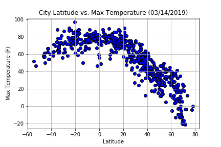
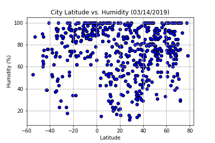
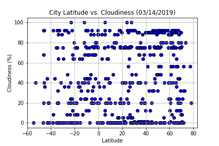
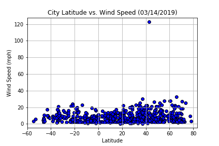

In this project, Python was used to access the OpenWeatherMap API to obtain weather data for a large number of cities.

## Python Code

```python
# Dependencies and Setup
import matplotlib.pyplot as plt
import pandas as pd
import numpy as np
import requests
import time
import json

# Import API key
from config import api_key

# Incorporated citipy to determine city based on latitude and longitude
from citipy import citipy

# Output File (CSV)
output_data_file = "output_data/cities.csv"

# Range of latitudes and longitudes
lat_range = (-90, 90)
lng_range = (-180, 180)
```

## Generate Cities List


```python
# List for holding lat_lngs and cities
lat_lngs = []
cities = []

# Create a set of random lat and lng combinations
lats = np.random.uniform(low=-90.000, high=90.000, size=1500)
lngs = np.random.uniform(low=-180.000, high=180.000, size=1500)
lat_lngs = zip(lats, lngs)

# Identify nearest city for each lat, lng combination
for lat_lng in lat_lngs:
    city = citipy.nearest_city(lat_lng[0], lat_lng[1]).city_name
    
    # If the city is unique, then add it to a our cities list
    if city not in cities:
        cities.append(city)

# Print the city count to confirm sufficient count
len(cities)
```


    624


## Perform API Calls
* Perform a weather check on each city using a series of successive API calls.
* Include a print log of each city as it is being processed (with the city number and city name)


```python
# Create lists for storing city weather data
city_name = []
cloudiness = []
country = []
date = []
humidity = []
lat = []
lng =  []
max_temp = []
wind_speed = []

# Set counter variables. Each city set includes up to 50 city records.
city_set = 1
city_record = 1

# Start data retrieval
print("Beginning Data Retrieval")
print("-----------------------------")

# Loop through list of cities
for city in cities:
 
    try:   
        
        print(f"Processing Record {city_record} of Set {city_set} | {city}")
        
        # Alter city set and/or city record counters 
        if city_record < 50:
            city_record +=1

        else:
            city_record = 1
            city_set += 1
            
            # OpenWeatherMap API free account only allows 60 requests per minute. Pause the loop for 60 seconds after each set.
            time.sleep(60)
        
        # Create base url that calls for weather search and brings back results in JSON
        target_url = "http://api.openweathermap.org/data/2.5/weather?q="+city+"&units=imperial&APPID="+api_key
        request = requests.get(target_url).json()       
        
        # Retreive data and append to lists
        city_name.append(request["name"])
        cloudiness.append(request["clouds"]["all"])
        country.append(request["sys"]["country"])
        date.append(request["dt"])
        humidity.append(request["main"]["humidity"])
        lat.append(request["coord"]["lat"])
        lng.append(request["coord"]["lon"])
        max_temp.append(request["main"]["temp_max"])
        wind_speed.append(request["wind"]["speed"])
        
                
    except:
        # Print error message if city is not found
        print("City not found. Skipping...")        

print("-----------------------------")
print("Data Retrieval Complete")
print("-----------------------------")

# Reset counter variables
city_record = 1
city_set = 1
```

    Beginning Data Retrieval
    -----------------------------
    Processing Record 1 of Set 1 | albany
    Processing Record 2 of Set 1 | mataura
    Processing Record 3 of Set 1 | acin
    City not found. Skipping...
    Processing Record 4 of Set 1 | vaitupu
    City not found. Skipping...
    Processing Record 5 of Set 1 | ancud
    Processing Record 6 of Set 1 | maragogi
    Processing Record 7 of Set 1 | jamestown
    Processing Record 8 of Set 1 | tasiilaq
    Processing Record 9 of Set 1 | butaritari
    Processing Record 10 of Set 1 | gedo
    Processing Record 11 of Set 1 | lavrentiya
    Processing Record 12 of Set 1 | sarangani
    Processing Record 13 of Set 1 | kaura namoda
    Processing Record 14 of Set 1 | normandin
    Processing Record 15 of Set 1 | sisimiut
    Processing Record 16 of Set 1 | port alfred
    Processing Record 17 of Set 1 | mar del plata
    Processing Record 18 of Set 1 | rikitea
    Processing Record 19 of Set 1 | upernavik
    Processing Record 20 of Set 1 | mana
    Processing Record 21 of Set 1 | quatre cocos
    Processing Record 22 of Set 1 | ola
    Processing Record 23 of Set 1 | dikson
    Processing Record 24 of Set 1 | kodinsk
    Processing Record 25 of Set 1 | vaini
    Processing Record 26 of Set 1 | cockburn harbour
    City not found. Skipping...
    Processing Record 27 of Set 1 | kapaa
    Processing Record 28 of Set 1 | llangefni
    Processing Record 29 of Set 1 | loanda
    Processing Record 30 of Set 1 | gaya
    Processing Record 31 of Set 1 | suao
    City not found. Skipping...
    Processing Record 32 of Set 1 | ushuaia
    Processing Record 33 of Set 1 | busselton
    Processing Record 34 of Set 1 | yellowknife
    Processing Record 35 of Set 1 | kandrian
    Processing Record 36 of Set 1 | barrow
    Processing Record 37 of Set 1 | oistins
    Processing Record 38 of Set 1 | bengkulu
    City not found. Skipping...
    Processing Record 39 of Set 1 | amderma
    City not found. Skipping...
    Processing Record 40 of Set 1 | kahului
    Processing Record 41 of Set 1 | aktau
    Processing Record 42 of Set 1 | hilo
    Processing Record 43 of Set 1 | kijang
    Processing Record 44 of Set 1 | longyearbyen
    Processing Record 45 of Set 1 | saint anthony
    Processing Record 46 of Set 1 | baykit
    Processing Record 47 of Set 1 | jujuy
    City not found. Skipping...
    Processing Record 48 of Set 1 | sao joao da barra
    Processing Record 49 of Set 1 | manicore
    Processing Record 50 of Set 1 | attawapiskat
    City not found. Skipping...
    Processing Record 1 of Set 2 | new norfolk
    Processing Record 2 of Set 2 | lasa
    Processing Record 3 of Set 2 | entre rios
    Processing Record 4 of Set 2 | praia da vitoria
    Processing Record 5 of Set 2 | castro
    Processing Record 6 of Set 2 | airai
    Processing Record 7 of Set 2 | hithadhoo
    Processing Record 8 of Set 2 | sanary-sur-mer
    Processing Record 9 of Set 2 | bredasdorp
    Processing Record 10 of Set 2 | santa eulalia del rio
    City not found. Skipping...
    Processing Record 11 of Set 2 | talnakh
    Processing Record 12 of Set 2 | caravelas
    Processing Record 13 of Set 2 | korla
    City not found. Skipping...
    Processing Record 14 of Set 2 | brigantine
    Processing Record 15 of Set 2 | tuktoyaktuk
    Processing Record 16 of Set 2 | gobabis
    Processing Record 17 of Set 2 | pevek
    Processing Record 18 of Set 2 | santiago de cuba
    Processing Record 19 of Set 2 | callaguip
    Processing Record 20 of Set 2 | durres
    Processing Record 21 of Set 2 | bahir dar
    Processing Record 22 of Set 2 | tual
    Processing Record 23 of Set 2 | pahrump
    Processing Record 24 of Set 2 | mutuipe
    Processing Record 25 of Set 2 | saint-philippe
    Processing Record 26 of Set 2 | noumea
    Processing Record 27 of Set 2 | puerto ayora
    Processing Record 28 of Set 2 | kaohsiung
    Processing Record 29 of Set 2 | punta arenas
    Processing Record 30 of Set 2 | izumo
    Processing Record 31 of Set 2 | aksha
    Processing Record 32 of Set 2 | stoyba
    City not found. Skipping...
    Processing Record 33 of Set 2 | phan rang
    City not found. Skipping...
    Processing Record 34 of Set 2 | whitehorse
    Processing Record 35 of Set 2 | saskylakh
    Processing Record 36 of Set 2 | chokurdakh
    Processing Record 37 of Set 2 | tiksi
    Processing Record 38 of Set 2 | yakeshi
    Processing Record 39 of Set 2 | bambous virieux
    Processing Record 40 of Set 2 | tyrma
    Processing Record 41 of Set 2 | chicama
    Processing Record 42 of Set 2 | belushya guba
    City not found. Skipping...
    Processing Record 43 of Set 2 | erenhot
    Processing Record 44 of Set 2 | hambantota
    Processing Record 45 of Set 2 | hobart
    Processing Record 46 of Set 2 | cape town
    Processing Record 47 of Set 2 | qaanaaq
    Processing Record 48 of Set 2 | sens
    Processing Record 49 of Set 2 | qunduz
    City not found. Skipping...
    Processing Record 50 of Set 2 | luderitz
    Processing Record 1 of Set 3 | santa lucia
    Processing Record 2 of Set 3 | tuatapere
    Processing Record 3 of Set 3 | mount gambier
    Processing Record 4 of Set 3 | tupelo
    Processing Record 5 of Set 3 | broome
    Processing Record 6 of Set 3 | huarmey
    Processing Record 7 of Set 3 | illoqqortoormiut
    City not found. Skipping...
    Processing Record 8 of Set 3 | hermanus
    Processing Record 9 of Set 3 | bouar
    Processing Record 10 of Set 3 | taolanaro
    City not found. Skipping...
    Processing Record 11 of Set 3 | port elizabeth
    Processing Record 12 of Set 3 | norman wells
    Processing Record 13 of Set 3 | alakurtti
    Processing Record 14 of Set 3 | banda aceh
    Processing Record 15 of Set 3 | tarudant
    City not found. Skipping...
    Processing Record 16 of Set 3 | westport
    Processing Record 17 of Set 3 | namibe
    Processing Record 18 of Set 3 | arraial do cabo
    Processing Record 19 of Set 3 | sept-iles
    Processing Record 20 of Set 3 | provideniya
    Processing Record 21 of Set 3 | ribeira grande
    Processing Record 22 of Set 3 | bluff
    Processing Record 23 of Set 3 | marawi
    Processing Record 24 of Set 3 | cabo san lucas
    Processing Record 25 of Set 3 | bethel
    Processing Record 26 of Set 3 | kodiak
    Processing Record 27 of Set 3 | azare
    Processing Record 28 of Set 3 | nouadhibou
    Processing Record 29 of Set 3 | lebu
    Processing Record 30 of Set 3 | margate
    Processing Record 31 of Set 3 | antsohihy
    Processing Record 32 of Set 3 | ciudad bolivar
    Processing Record 33 of Set 3 | oranjemund
    Processing Record 34 of Set 3 | bogorodskoye
    Processing Record 35 of Set 3 | pisco
    Processing Record 36 of Set 3 | port-gentil
    Processing Record 37 of Set 3 | atar
    Processing Record 38 of Set 3 | jizan
    Processing Record 39 of Set 3 | tautira
    Processing Record 40 of Set 3 | macau
    Processing Record 41 of Set 3 | poronaysk
    Processing Record 42 of Set 3 | shabqadar
    Processing Record 43 of Set 3 | skjervoy
    Processing Record 44 of Set 3 | ixtapa
    Processing Record 45 of Set 3 | cairns
    Processing Record 46 of Set 3 | saint-louis
    Processing Record 47 of Set 3 | kolokani
    Processing Record 48 of Set 3 | siddapur
    Processing Record 49 of Set 3 | los llanos de aridane
    Processing Record 50 of Set 3 | hasaki
    Processing Record 1 of Set 4 | tanout
    Processing Record 2 of Set 4 | maloy
    Processing Record 3 of Set 4 | tsihombe
    City not found. Skipping...
    Processing Record 4 of Set 4 | ahipara
    Processing Record 5 of Set 4 | bonthe
    Processing Record 6 of Set 4 | healdsburg
    Processing Record 7 of Set 4 | vao
    Processing Record 8 of Set 4 | takoradi
    Processing Record 9 of Set 4 | alabaster
    Processing Record 10 of Set 4 | yulara
    Processing Record 11 of Set 4 | mtwara
    Processing Record 12 of Set 4 | nikolskoye
    Processing Record 13 of Set 4 | laguna
    Processing Record 14 of Set 4 | agadez
    Processing Record 15 of Set 4 | vardo
    Processing Record 16 of Set 4 | khatanga
    Processing Record 17 of Set 4 | tateyama
    Processing Record 18 of Set 4 | carnarvon
    Processing Record 19 of Set 4 | sungaipenuh
    Processing Record 20 of Set 4 | dingle
    Processing Record 21 of Set 4 | orange cove
    Processing Record 22 of Set 4 | clyde river
    Processing Record 23 of Set 4 | east london
    Processing Record 24 of Set 4 | logansport
    Processing Record 25 of Set 4 | severobaykalsk
    Processing Record 26 of Set 4 | hovd
    Processing Record 27 of Set 4 | frederikshavn
    Processing Record 28 of Set 4 | halifax
    Processing Record 29 of Set 4 | nioro
    Processing Record 30 of Set 4 | kavieng
    Processing Record 31 of Set 4 | westpunt
    City not found. Skipping...
    Processing Record 32 of Set 4 | barentsburg
    City not found. Skipping...
    Processing Record 33 of Set 4 | aflu
    City not found. Skipping...
    Processing Record 34 of Set 4 | tilichiki
    Processing Record 35 of Set 4 | buraydah
    Processing Record 36 of Set 4 | belaya gora
    Processing Record 37 of Set 4 | martil
    Processing Record 38 of Set 4 | nizhneyansk
    City not found. Skipping...
    Processing Record 39 of Set 4 | qaqortoq
    Processing Record 40 of Set 4 | bubaque
    Processing Record 41 of Set 4 | sinnamary
    Processing Record 42 of Set 4 | bandarbeyla
    Processing Record 43 of Set 4 | vila franca do campo
    Processing Record 44 of Set 4 | nanortalik
    Processing Record 45 of Set 4 | atuona
    Processing Record 46 of Set 4 | cadillac
    Processing Record 47 of Set 4 | karkaralinsk
    City not found. Skipping...
    Processing Record 48 of Set 4 | birao
    Processing Record 49 of Set 4 | phalombe
    Processing Record 50 of Set 4 | jinchang
    Processing Record 1 of Set 5 | faanui
    Processing Record 2 of Set 5 | cherskiy
    Processing Record 3 of Set 5 | sompeta
    Processing Record 4 of Set 5 | pottstown
    Processing Record 5 of Set 5 | zhigansk
    Processing Record 6 of Set 5 | asyut
    Processing Record 7 of Set 5 | souillac
    Processing Record 8 of Set 5 | carei
    Processing Record 9 of Set 5 | lovozero
    Processing Record 10 of Set 5 | lander
    Processing Record 11 of Set 5 | grand river south east
    City not found. Skipping...
    Processing Record 12 of Set 5 | berlevag
    Processing Record 13 of Set 5 | kamina
    Processing Record 14 of Set 5 | leningradskiy
    Processing Record 15 of Set 5 | kirakira
    Processing Record 16 of Set 5 | iqaluit
    Processing Record 17 of Set 5 | kaitangata
    Processing Record 18 of Set 5 | saint george
    Processing Record 19 of Set 5 | savinesti
    Processing Record 20 of Set 5 | haines junction
    Processing Record 21 of Set 5 | pine bluff
    Processing Record 22 of Set 5 | victor harbor
    Processing Record 23 of Set 5 | fortuna
    Processing Record 24 of Set 5 | pitimbu
    Processing Record 25 of Set 5 | umm lajj
    Processing Record 26 of Set 5 | mys shmidta
    City not found. Skipping...
    Processing Record 27 of Set 5 | san patricio
    Processing Record 28 of Set 5 | matara
    Processing Record 29 of Set 5 | padang
    Processing Record 30 of Set 5 | helong
    Processing Record 31 of Set 5 | kalikino
    Processing Record 32 of Set 5 | pio xii
    Processing Record 33 of Set 5 | beringovskiy
    Processing Record 34 of Set 5 | namatanai
    Processing Record 35 of Set 5 | mahebourg
    Processing Record 36 of Set 5 | port macquarie
    Processing Record 37 of Set 5 | kruisfontein
    Processing Record 38 of Set 5 | belozerskoye
    Processing Record 39 of Set 5 | kurikka
    Processing Record 40 of Set 5 | lompoc
    Processing Record 41 of Set 5 | camopi
    Processing Record 42 of Set 5 | port augusta
    Processing Record 43 of Set 5 | san clemente
    Processing Record 44 of Set 5 | opuwo
    Processing Record 45 of Set 5 | geraldton
    Processing Record 46 of Set 5 | porto murtinho
    Processing Record 47 of Set 5 | golden
    Processing Record 48 of Set 5 | batsfjord
    Processing Record 49 of Set 5 | sechura
    Processing Record 50 of Set 5 | puerto baquerizo moreno
    Processing Record 1 of Set 6 | genhe
    Processing Record 2 of Set 6 | nantucket
    Processing Record 3 of Set 6 | dunedin
    Processing Record 4 of Set 6 | abu samrah
    Processing Record 5 of Set 6 | severo-kurilsk
    Processing Record 6 of Set 6 | temiscaming
    Processing Record 7 of Set 6 | flin flon
    Processing Record 8 of Set 6 | necochea
    Processing Record 9 of Set 6 | saldanha
    Processing Record 10 of Set 6 | tromso
    Processing Record 11 of Set 6 | seoul
    Processing Record 12 of Set 6 | baruun-urt
    Processing Record 13 of Set 6 | moree
    Processing Record 14 of Set 6 | la ronge
    Processing Record 15 of Set 6 | paamiut
    Processing Record 16 of Set 6 | narsaq
    Processing Record 17 of Set 6 | thompson
    Processing Record 18 of Set 6 | gurupi
    Processing Record 19 of Set 6 | severo-yeniseyskiy
    Processing Record 20 of Set 6 | ponta delgada
    Processing Record 21 of Set 6 | imeni poliny osipenko
    Processing Record 22 of Set 6 | ouesso
    Processing Record 23 of Set 6 | caborca
    Processing Record 24 of Set 6 | labuhan
    Processing Record 25 of Set 6 | mazamari
    Processing Record 26 of Set 6 | baoning
    Processing Record 27 of Set 6 | lesnoy
    Processing Record 28 of Set 6 | tezpur
    Processing Record 29 of Set 6 | lazaro cardenas
    Processing Record 30 of Set 6 | sioux lookout
    Processing Record 31 of Set 6 | quzhou
    Processing Record 32 of Set 6 | saleaula
    City not found. Skipping...
    Processing Record 33 of Set 6 | asau
    City not found. Skipping...
    Processing Record 34 of Set 6 | lorengau
    Processing Record 35 of Set 6 | puerto del rosario
    Processing Record 36 of Set 6 | luau
    Processing Record 37 of Set 6 | xai-xai
    Processing Record 38 of Set 6 | skibbereen
    Processing Record 39 of Set 6 | sacramento
    Processing Record 40 of Set 6 | amga
    Processing Record 41 of Set 6 | kedarnath
    City not found. Skipping...
    Processing Record 42 of Set 6 | coquimbo
    Processing Record 43 of Set 6 | gryfino
    Processing Record 44 of Set 6 | burnie
    Processing Record 45 of Set 6 | tapaua
    City not found. Skipping...
    Processing Record 46 of Set 6 | paita
    Processing Record 47 of Set 6 | vysokogornyy
    Processing Record 48 of Set 6 | cacu
    Processing Record 49 of Set 6 | tahe
    Processing Record 50 of Set 6 | victoria
    Processing Record 1 of Set 7 | baker city
    Processing Record 2 of Set 7 | varzea da palma
    Processing Record 3 of Set 7 | puqi
    Processing Record 4 of Set 7 | kidal
    Processing Record 5 of Set 7 | high rock
    Processing Record 6 of Set 7 | surgut
    Processing Record 7 of Set 7 | banjar
    Processing Record 8 of Set 7 | guerrero negro
    Processing Record 9 of Set 7 | charters towers
    Processing Record 10 of Set 7 | dale
    Processing Record 11 of Set 7 | ibra
    Processing Record 12 of Set 7 | ilulissat
    Processing Record 13 of Set 7 | misratah
    Processing Record 14 of Set 7 | yichun
    Processing Record 15 of Set 7 | rudnaya pristan
    Processing Record 16 of Set 7 | birjand
    Processing Record 17 of Set 7 | karakose
    City not found. Skipping...
    Processing Record 18 of Set 7 | nemuro
    Processing Record 19 of Set 7 | ponta do sol
    Processing Record 20 of Set 7 | matagami
    Processing Record 21 of Set 7 | kang
    Processing Record 22 of Set 7 | ambodifototra
    City not found. Skipping...
    Processing Record 23 of Set 7 | torbay
    Processing Record 24 of Set 7 | naze
    Processing Record 25 of Set 7 | gibara
    Processing Record 26 of Set 7 | upata
    Processing Record 27 of Set 7 | aklavik
    Processing Record 28 of Set 7 | sabang
    Processing Record 29 of Set 7 | hobyo
    Processing Record 30 of Set 7 | aripuana
    Processing Record 31 of Set 7 | mandan
    Processing Record 32 of Set 7 | tecoanapa
    Processing Record 33 of Set 7 | wahiawa
    Processing Record 34 of Set 7 | krasnousolskiy
    City not found. Skipping...
    Processing Record 35 of Set 7 | makakilo city
    Processing Record 36 of Set 7 | suluq
    Processing Record 37 of Set 7 | bokspits
    City not found. Skipping...
    Processing Record 38 of Set 7 | bilibino
    Processing Record 39 of Set 7 | yantai
    Processing Record 40 of Set 7 | muroto
    Processing Record 41 of Set 7 | aykhal
    Processing Record 42 of Set 7 | resistencia
    Processing Record 43 of Set 7 | chagda
    City not found. Skipping...
    Processing Record 44 of Set 7 | florence
    Processing Record 45 of Set 7 | mandera
    Processing Record 46 of Set 7 | bilma
    Processing Record 47 of Set 7 | asayita
    City not found. Skipping...
    Processing Record 48 of Set 7 | celestun
    Processing Record 49 of Set 7 | chuy
    Processing Record 50 of Set 7 | labytnangi
    Processing Record 1 of Set 8 | carlagan
    Processing Record 2 of Set 8 | berestechko
    Processing Record 3 of Set 8 | lincoln
    Processing Record 4 of Set 8 | mangai
    Processing Record 5 of Set 8 | canyon
    Processing Record 6 of Set 8 | trofors
    Processing Record 7 of Set 8 | requena
    Processing Record 8 of Set 8 | ust-karsk
    Processing Record 9 of Set 8 | baza
    Processing Record 10 of Set 8 | seydi
    Processing Record 11 of Set 8 | raudeberg
    Processing Record 12 of Set 8 | whithorn
    Processing Record 13 of Set 8 | santiago
    Processing Record 14 of Set 8 | balabac
    Processing Record 15 of Set 8 | flinders
    Processing Record 16 of Set 8 | rocha
    Processing Record 17 of Set 8 | dwarka
    Processing Record 18 of Set 8 | kajaani
    Processing Record 19 of Set 8 | lake havasu city
    Processing Record 20 of Set 8 | vostok
    Processing Record 21 of Set 8 | mutoko
    Processing Record 22 of Set 8 | marmora
    Processing Record 23 of Set 8 | sentyabrskiy
    City not found. Skipping...
    Processing Record 24 of Set 8 | puerto leguizamo
    Processing Record 25 of Set 8 | daru
    Processing Record 26 of Set 8 | rybachiy
    Processing Record 27 of Set 8 | nyurba
    Processing Record 28 of Set 8 | mucuri
    Processing Record 29 of Set 8 | namtsy
    Processing Record 30 of Set 8 | san quintin
    Processing Record 31 of Set 8 | tsabong
    Processing Record 32 of Set 8 | kotka
    Processing Record 33 of Set 8 | katangli
    Processing Record 34 of Set 8 | devarkonda
    Processing Record 35 of Set 8 | deep river
    Processing Record 36 of Set 8 | tuy hoa
    Processing Record 37 of Set 8 | port antonio
    Processing Record 38 of Set 8 | boden
    Processing Record 39 of Set 8 | lakes entrance
    Processing Record 40 of Set 8 | boa vista
    Processing Record 41 of Set 8 | phatthalung
    Processing Record 42 of Set 8 | cassilandia
    Processing Record 43 of Set 8 | houma
    Processing Record 44 of Set 8 | lashio
    Processing Record 45 of Set 8 | harper
    Processing Record 46 of Set 8 | kavaratti
    Processing Record 47 of Set 8 | mentok
    City not found. Skipping...
    Processing Record 48 of Set 8 | damietta
    Processing Record 49 of Set 8 | pangnirtung
    Processing Record 50 of Set 8 | labuan
    Processing Record 1 of Set 9 | utiroa
    City not found. Skipping...
    Processing Record 2 of Set 9 | lagoa
    Processing Record 3 of Set 9 | sitka
    Processing Record 4 of Set 9 | chihuahua
    Processing Record 5 of Set 9 | port hardy
    Processing Record 6 of Set 9 | mpika
    Processing Record 7 of Set 9 | maceio
    Processing Record 8 of Set 9 | shache
    Processing Record 9 of Set 9 | macae
    Processing Record 10 of Set 9 | balakhta
    Processing Record 11 of Set 9 | nuevitas
    Processing Record 12 of Set 9 | pasighat
    Processing Record 13 of Set 9 | cidreira
    Processing Record 14 of Set 9 | kenai
    Processing Record 15 of Set 9 | kalmunai
    Processing Record 16 of Set 9 | avarua
    Processing Record 17 of Set 9 | marsh harbour
    Processing Record 18 of Set 9 | aktash
    City not found. Skipping...
    Processing Record 19 of Set 9 | yambio
    City not found. Skipping...
    Processing Record 20 of Set 9 | smithers
    Processing Record 21 of Set 9 | east millcreek
    Processing Record 22 of Set 9 | samfya
    Processing Record 23 of Set 9 | seduva
    Processing Record 24 of Set 9 | villazon
    City not found. Skipping...
    Processing Record 25 of Set 9 | nagato
    Processing Record 26 of Set 9 | ketchikan
    Processing Record 27 of Set 9 | klaksvik
    Processing Record 28 of Set 9 | sobolevo
    Processing Record 29 of Set 9 | iskateley
    Processing Record 30 of Set 9 | santa rosa
    Processing Record 31 of Set 9 | auki
    Processing Record 32 of Set 9 | bulawayo
    Processing Record 33 of Set 9 | usogorsk
    Processing Record 34 of Set 9 | mullaitivu
    City not found. Skipping...
    Processing Record 35 of Set 9 | bur gabo
    City not found. Skipping...
    Processing Record 36 of Set 9 | bastia
    Processing Record 37 of Set 9 | le port
    Processing Record 38 of Set 9 | belle glade
    Processing Record 39 of Set 9 | yanggu
    Processing Record 40 of Set 9 | yanan
    City not found. Skipping...
    Processing Record 41 of Set 9 | lethem
    Processing Record 42 of Set 9 | grand gaube
    Processing Record 43 of Set 9 | ijaki
    City not found. Skipping...
    Processing Record 44 of Set 9 | isangel
    Processing Record 45 of Set 9 | jumla
    Processing Record 46 of Set 9 | satuk
    Processing Record 47 of Set 9 | beyneu
    Processing Record 48 of Set 9 | tehachapi
    Processing Record 49 of Set 9 | hamilton
    Processing Record 50 of Set 9 | rawson
    Processing Record 1 of Set 10 | kamenskoye
    City not found. Skipping...
    Processing Record 2 of Set 10 | chapais
    Processing Record 3 of Set 10 | kochi
    Processing Record 4 of Set 10 | esmeraldas
    Processing Record 5 of Set 10 | mao
    Processing Record 6 of Set 10 | buala
    Processing Record 7 of Set 10 | kano
    Processing Record 8 of Set 10 | katobu
    Processing Record 9 of Set 10 | port blair
    Processing Record 10 of Set 10 | skalistyy
    City not found. Skipping...
    Processing Record 11 of Set 10 | champerico
    Processing Record 12 of Set 10 | quelimane
    Processing Record 13 of Set 10 | wanning
    Processing Record 14 of Set 10 | kaset sombun
    Processing Record 15 of Set 10 | luorong
    Processing Record 16 of Set 10 | kutum
    Processing Record 17 of Set 10 | japura
    Processing Record 18 of Set 10 | chernyshevskiy
    Processing Record 19 of Set 10 | ituni
    City not found. Skipping...
    Processing Record 20 of Set 10 | nandi hills
    Processing Record 21 of Set 10 | saint-leu
    Processing Record 22 of Set 10 | menongue
    Processing Record 23 of Set 10 | acarau
    City not found. Skipping...
    Processing Record 24 of Set 10 | porto novo
    Processing Record 25 of Set 10 | gurskoye
    City not found. Skipping...
    Processing Record 26 of Set 10 | chepareria
    Processing Record 27 of Set 10 | port-cartier
    Processing Record 28 of Set 10 | lisakovsk
    Processing Record 29 of Set 10 | banyumas
    Processing Record 30 of Set 10 | estevan
    Processing Record 31 of Set 10 | gambo
    Processing Record 32 of Set 10 | bataipora
    Processing Record 33 of Set 10 | khorinsk
    Processing Record 34 of Set 10 | mandalgovi
    Processing Record 35 of Set 10 | sabha
    Processing Record 36 of Set 10 | praya
    Processing Record 37 of Set 10 | vestbygda
    City not found. Skipping...
    Processing Record 38 of Set 10 | tessalit
    Processing Record 39 of Set 10 | natitingou
    Processing Record 40 of Set 10 | sao filipe
    Processing Record 41 of Set 10 | louisbourg
    City not found. Skipping...
    Processing Record 42 of Set 10 | te anau
    Processing Record 43 of Set 10 | monroe
    Processing Record 44 of Set 10 | vila velha
    Processing Record 45 of Set 10 | deputatskiy
    Processing Record 46 of Set 10 | esperance
    Processing Record 47 of Set 10 | tongling
    Processing Record 48 of Set 10 | stornoway
    City not found. Skipping...
    Processing Record 49 of Set 10 | adrar
    Processing Record 50 of Set 10 | jiddah
    City not found. Skipping...
    Processing Record 1 of Set 11 | thunder bay
    Processing Record 2 of Set 11 | omboue
    Processing Record 3 of Set 11 | matay
    Processing Record 4 of Set 11 | mareeba
    Processing Record 5 of Set 11 | chara
    Processing Record 6 of Set 11 | haibowan
    City not found. Skipping...
    Processing Record 7 of Set 11 | kendari
    Processing Record 8 of Set 11 | roald
    Processing Record 9 of Set 11 | okhotsk
    Processing Record 10 of Set 11 | iberia
    Processing Record 11 of Set 11 | ternate
    Processing Record 12 of Set 11 | nushki
    Processing Record 13 of Set 11 | doha
    Processing Record 14 of Set 11 | vanimo
    Processing Record 15 of Set 11 | lagunas
    Processing Record 16 of Set 11 | turochak
    Processing Record 17 of Set 11 | atambua
    Processing Record 18 of Set 11 | alofi
    Processing Record 19 of Set 11 | tucurui
    Processing Record 20 of Set 11 | khurda
    Processing Record 21 of Set 11 | yar-sale
    Processing Record 22 of Set 11 | srednekolymsk
    Processing Record 23 of Set 11 | tikrit
    Processing Record 24 of Set 11 | pinega
    Processing Record 25 of Set 11 | nirsa
    Processing Record 26 of Set 11 | ust-ilimsk
    Processing Record 27 of Set 11 | rapid valley
    Processing Record 28 of Set 11 | los palacios
    Processing Record 29 of Set 11 | ukiah
    Processing Record 30 of Set 11 | jackson
    Processing Record 31 of Set 11 | nizhniy odes
    Processing Record 32 of Set 11 | salalah
    Processing Record 33 of Set 11 | krasnoselkup
    City not found. Skipping...
    Processing Record 34 of Set 11 | kingston
    Processing Record 35 of Set 11 | katsuura
    Processing Record 36 of Set 11 | zhaotong
    Processing Record 37 of Set 11 | pontianak
    Processing Record 38 of Set 11 | ust-tsilma
    Processing Record 39 of Set 11 | san cristobal
    Processing Record 40 of Set 11 | san fernando
    Processing Record 41 of Set 11 | kaa-khem
    Processing Record 42 of Set 11 | mayo
    Processing Record 43 of Set 11 | burley
    Processing Record 44 of Set 11 | zyryanka
    Processing Record 45 of Set 11 | fairbanks
    Processing Record 46 of Set 11 | saryshagan
    City not found. Skipping...
    Processing Record 47 of Set 11 | caohe
    Processing Record 48 of Set 11 | moranbah
    Processing Record 49 of Set 11 | samarai
    Processing Record 50 of Set 11 | reconquista
    Processing Record 1 of Set 12 | navolato
    Processing Record 2 of Set 12 | tabiauea
    City not found. Skipping...
    Processing Record 3 of Set 12 | zhanaozen
    Processing Record 4 of Set 12 | fredericksburg
    Processing Record 5 of Set 12 | la romana
    Processing Record 6 of Set 12 | wewak
    Processing Record 7 of Set 12 | xiaoweizhai
    Processing Record 8 of Set 12 | miri
    Processing Record 9 of Set 12 | udachnyy
    Processing Record 10 of Set 12 | fairview
    Processing Record 11 of Set 12 | itarema
    Processing Record 12 of Set 12 | tumannyy
    City not found. Skipping...
    Processing Record 13 of Set 12 | kusti
    City not found. Skipping...
    Processing Record 14 of Set 12 | gongzhuling
    Processing Record 15 of Set 12 | pospelikha
    Processing Record 16 of Set 12 | dipkarpaz
    City not found. Skipping...
    Processing Record 17 of Set 12 | shizukuishi
    Processing Record 18 of Set 12 | moreira sales
    Processing Record 19 of Set 12 | havre-saint-pierre
    Processing Record 20 of Set 12 | marcona
    City not found. Skipping...
    Processing Record 21 of Set 12 | sola
    Processing Record 22 of Set 12 | tonj
    City not found. Skipping...
    Processing Record 23 of Set 12 | husavik
    Processing Record 24 of Set 12 | sao jose da coroa grande
    Processing Record 25 of Set 12 | umzimvubu
    City not found. Skipping...
    Processing Record 26 of Set 12 | richards bay
    Processing Record 27 of Set 12 | phonhong
    Processing Record 28 of Set 12 | shingu
    Processing Record 29 of Set 12 | tezu
    Processing Record 30 of Set 12 | gonbad-e qabus
    Processing Record 31 of Set 12 | rudsar
    Processing Record 32 of Set 12 | kieta
    Processing Record 33 of Set 12 | viligili
    City not found. Skipping...
    Processing Record 34 of Set 12 | hervey bay
    Processing Record 35 of Set 12 | north las vegas
    Processing Record 36 of Set 12 | comodoro rivadavia
    Processing Record 37 of Set 12 | ulladulla
    Processing Record 38 of Set 12 | la asuncion
    Processing Record 39 of Set 12 | college
    Processing Record 40 of Set 12 | ostrovnoy
    Processing Record 41 of Set 12 | bissau
    Processing Record 42 of Set 12 | constantine
    Processing Record 43 of Set 12 | port hedland
    Processing Record 44 of Set 12 | sataua
    City not found. Skipping...
    Processing Record 45 of Set 12 | fort nelson
    Processing Record 46 of Set 12 | beloha
    Processing Record 47 of Set 12 | vestmannaeyjar
    Processing Record 48 of Set 12 | boulder
    Processing Record 49 of Set 12 | les cayes
    Processing Record 50 of Set 12 | taoudenni
    Processing Record 1 of Set 13 | kisangani
    Processing Record 2 of Set 13 | broken hill
    Processing Record 3 of Set 13 | gazli
    Processing Record 4 of Set 13 | myitkyina
    Processing Record 5 of Set 13 | tara
    Processing Record 6 of Set 13 | sorland
    Processing Record 7 of Set 13 | andenes
    City not found. Skipping...
    Processing Record 8 of Set 13 | teya
    Processing Record 9 of Set 13 | kampong chhnang
    Processing Record 10 of Set 13 | meyungs
    City not found. Skipping...
    Processing Record 11 of Set 13 | nianzishan
    Processing Record 12 of Set 13 | yumen
    Processing Record 13 of Set 13 | thai binh
    Processing Record 14 of Set 13 | macomb
    Processing Record 15 of Set 13 | luangwa
    Processing Record 16 of Set 13 | gao
    Processing Record 17 of Set 13 | bathsheba
    Processing Record 18 of Set 13 | las vegas
    Processing Record 19 of Set 13 | samalaeulu
    City not found. Skipping...
    Processing Record 20 of Set 13 | chancay
    Processing Record 21 of Set 13 | chumikan
    Processing Record 22 of Set 13 | mokokchung
    Processing Record 23 of Set 13 | nerchinsk
    Processing Record 24 of Set 13 | kiruna
    -----------------------------
    Data Retrieval Complete
    -----------------------------
    

## Convert Raw Data to Dataframe
* Export the city data into a .csv.
* Display the DataFrame.


```python
# Create city weather dataframe
city_weather_data_df = pd.DataFrame({
    "City": city_name,
    "Cloudiness": cloudiness,
    "Country": country,
    "Date": date,
    "Humidity": humidity,
    "Lat": lat,
    "Lng": lng,
    "Max Temp": max_temp,
    "Wind Speed": wind_speed
})

# Export city data to CSV
city_weather_data_df.to_csv("Output/city_weather_data.csv", encoding="utf-8", index=False, header=True)

# Count number of values
city_weather_data_df.count()
```


    City          555
    Cloudiness    555
    Country       555
    Date          555
    Humidity      555
    Lat           555
    Lng           555
    Max Temp      555
    Wind Speed    555
    dtype: int64


```python
# Read CSV and display dataframe
city_weather_csv = "Output/city_weather_data.csv"
city_weather_df = pd.read_csv(city_weather_csv)
city_weather_df.head()
```

<div>
<table border="1" class="dataframe">
  <thead>
    <tr style="text-align: right;">
      <th></th>
      <th>City</th>
      <th>Cloudiness</th>
      <th>Country</th>
      <th>Date</th>
      <th>Humidity</th>
      <th>Lat</th>
      <th>Lng</th>
      <th>Max Temp</th>
      <th>Wind Speed</th>
    </tr>
  </thead>
  <tbody>
    <tr>
      <th>0</th>
      <td>Albany</td>
      <td>90</td>
      <td>US</td>
      <td>1552525685</td>
      <td>51</td>
      <td>42.65</td>
      <td>-73.75</td>
      <td>42.01</td>
      <td>3.36</td>
    </tr>
    <tr>
      <th>1</th>
      <td>Mataura</td>
      <td>20</td>
      <td>NZ</td>
      <td>1552525207</td>
      <td>65</td>
      <td>-46.19</td>
      <td>168.86</td>
      <td>59.00</td>
      <td>1.99</td>
    </tr>
    <tr>
      <th>2</th>
      <td>Ancud</td>
      <td>20</td>
      <td>CL</td>
      <td>1552521600</td>
      <td>76</td>
      <td>-41.87</td>
      <td>-73.83</td>
      <td>53.60</td>
      <td>8.05</td>
    </tr>
    <tr>
      <th>3</th>
      <td>Maragogi</td>
      <td>68</td>
      <td>BR</td>
      <td>1552526261</td>
      <td>100</td>
      <td>-9.01</td>
      <td>-35.22</td>
      <td>76.79</td>
      <td>2.73</td>
    </tr>
    <tr>
      <th>4</th>
      <td>Jamestown</td>
      <td>0</td>
      <td>AU</td>
      <td>1552525545</td>
      <td>94</td>
      <td>-33.21</td>
      <td>138.60</td>
      <td>62.16</td>
      <td>4.41</td>
    </tr>
  </tbody>
</table>
</div>


## Plotting the data
* Use proper labeling of the plots using plot titles (including date of analysis) and axe labels.
* Save the plotted figures as .pngs.

### Latitude vs. Temperature Plot


```python
# Get latitude and temperature
city_latitude = city_weather_df.loc[:,"Lat"]
city_temperature = city_weather_df.loc[:,"Max Temp"]

# Get API call date
called_datetime = city_weather_df.loc[0,"Date"]
called_datetime = pd.to_datetime(called_datetime, unit="s")
called_date = pd.to_datetime(called_datetime).date()
called_date = called_date.strftime('%m/%d/%Y')

# Generate scatterplot
plt.scatter(city_latitude, city_temperature, marker="o", facecolors="blue", edgecolors="black")

# Set up limits for x-axis and y-axis
min_x = city_latitude.min()
min_y = city_temperature.min()
max_x = city_latitude.max()
max_y = city_temperature.max()

plt.ylim(min_y - 5, max_y + 5)
plt.xlim(min_x - 5, max_x + 5)

# Create title, gridlines, x label, and y label for the scatterplot
plt.title(f"City Latitude vs. Max Temperature ({called_date})")
plt.ylabel("Max Temperature (F)")
plt.xlabel("Latitude")
plt.grid(axis="both")

# Save the scatterplot
plt.savefig("Output/Latitude_Temperature_Scatterplot.png")

# Display the scatterplot
plt.show()
```



### Latitude vs. Humidity Plot


```python
# Get latitude and humidity
city_latitude = city_weather_df.loc[:,"Lat"]
city_humidity = city_weather_df.loc[:,"Humidity"]

# Get API call date
called_datetime = city_weather_df.loc[0,"Date"]
called_datetime = pd.to_datetime(called_datetime, unit="s")
called_date = pd.to_datetime(called_datetime).date()
called_date = called_date.strftime('%m/%d/%Y')

# Generate scatterplot
plt.scatter(city_latitude, city_humidity, marker="o", facecolors="blue", edgecolors="black")

# Set up limits for x-axis and y-axis
min_x = city_latitude.min()
min_y = city_humidity.min()
max_x = city_latitude.max()
max_y = city_humidity.max()

plt.ylim(min_y - 5, max_y + 5)
plt.xlim(min_x - 5, max_x + 5)

# Create title, gridlines, x label, and y label for the scatterplot
plt.title(f"City Latitude vs. Humidity ({called_date})")
plt.ylabel("Humidity (%)")
plt.xlabel("Latitude")
plt.grid(axis="both")

# Save the scatterplot
plt.savefig("Output/Latitude_Humidity_Scatterplot.png")

# Display the scatterplot
plt.show()
```



### Latitude vs. Cloudiness Plot


```python
# Get latitude and cloudiness
city_latitude = city_weather_df.loc[:,"Lat"]
city_cloudiness = city_weather_df.loc[:,"Cloudiness"]

# Get API call date
called_datetime = city_weather_df.loc[0,"Date"]
called_datetime = pd.to_datetime(called_datetime, unit="s")
called_date = pd.to_datetime(called_datetime).date()
called_date = called_date.strftime('%m/%d/%Y')

# Generate scatterplot
plt.scatter(city_latitude, city_cloudiness, marker="o", facecolors="blue", edgecolors="black")

# Set up limits for x-axis and y-axis
min_x = city_latitude.min()
min_y = city_cloudiness.min()
max_x = city_latitude.max()
max_y = city_cloudiness.max()

plt.ylim(min_y - 5, max_y + 5)
plt.xlim(min_x - 5, max_x + 5)

# Create title, gridlines, x label, and y label for the scatterplot
plt.title(f"City Latitude vs. Cloudiness ({called_date})")
plt.ylabel("Cloudiness (%)")
plt.xlabel("Latitude")
plt.grid(axis="both")

# Save the scatterplot
plt.savefig("Output/Latitude_Cloudiness_Scatterplot.png")

# Display the scatterplot
plt.show()
```




### Latitude vs. Wind Speed Plot


```python
# Get latitude and wind speed
city_latitude = city_weather_df.loc[:,"Lat"]
city_wind_speed = city_weather_df.loc[:,"Wind Speed"]

# Get API call date
called_datetime = city_weather_df.loc[0,"Date"]
called_datetime = pd.to_datetime(called_datetime, unit="s")
called_date = pd.to_datetime(called_datetime).date()
called_date = called_date.strftime('%m/%d/%Y')

# Generate scatterplot
plt.scatter(city_latitude, city_wind_speed, marker="o", facecolors="blue", edgecolors="black")

# Set up limits for x-axis and y-axis
min_x = city_latitude.min()
min_y = city_wind_speed.min()
max_x = city_latitude.max()
max_y = city_wind_speed.max()

plt.ylim(min_y - 5, max_y + 5)
plt.xlim(min_x - 5, max_x + 5)

# Create title, gridlines, x label, and y label for the scatterplot
plt.title(f"City Latitude vs. Wind Speed ({called_date})")
plt.ylabel("Wind Speed (mph)")
plt.xlabel("Latitude")
plt.grid(axis="both")

# Save the scatterplot
plt.savefig("Output/Latitude_Wind_Speed_Scatterplot.png")

# Display the scatterplot
plt.show()
```



## Weather Analysis

### Latitude vs Temperature


The temperature increases significantly as one approaches the equator (0 Deg. Latitude).  However, the temperature in 
the southern hemisphere tends to be higher in this time of year than the northern hemisphere.

### Latitude vs Cloudiness


There is no strong relationship between latitude and cloudiness.  Some cities have cloudiness at 0% or 100%.


### Latitude vs Humidity


There is no strong relationship between latitude and humidity.  Some cities have humidity above 90%.


### Latitude vs Wind Speed


There is no strong relationship between latitude and wind speed.  Some cities have wind speed above 20 mph.